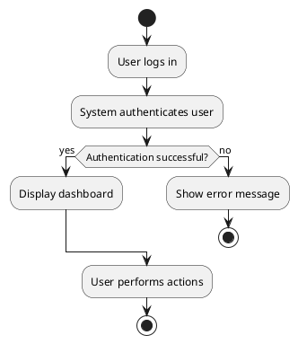

# Activity Diagrams

This section illustrates the flow of activities or processes within the system.

[Description of your Activity Diagram]

```plantuml
@startuml
start
:User logs in;
:System authenticates user;
if (Authentication successful?) then (yes)
  :Display dashboard;
else (no)
  :Show error message;
  stop
endif
:User performs actions;
stop
@enduml
```
