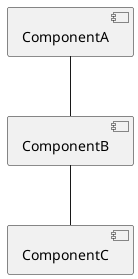

# Component Diagrams

This section shows the structural relationships between components of the system.

[Description of your Component Diagram]

```plantuml
@startuml
component [ComponentA]
component [ComponentB]
component [ComponentC]

[ComponentA] -- [ComponentB]
[ComponentB] -- [ComponentC]
@enduml
```
