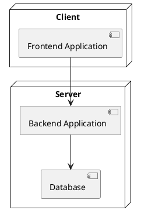

# Deployment Diagrams

This section illustrates the physical deployment of software components on hardware nodes.

[Description of your Deployment Diagram]

```plantuml
@startuml
node "Server" {
  component "Backend Application"
  component "Database"
}

node "Client" {
  component "Frontend Application"
}

"Frontend Application" --> "Backend Application"
"Backend Application" --> "Database"
@enduml
```
