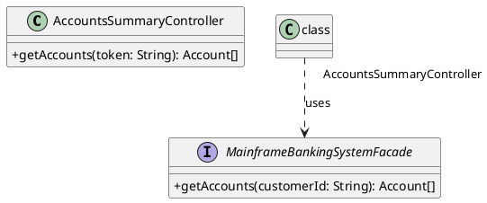

# Level 4: Code Diagram

The Code Diagram is the lowest and most detailed level of the C4 model, and its use is **optional**. It zooms into an individual **component** to show how it is implemented in code.

This level of detail is often best served by the code itself. Modern IDEs provide powerful tools for navigating and understanding source code, which is always the ultimate source of truth. Creating and maintaining detailed code-level diagrams can be time-consuming and often leads to documentation that quickly becomes outdated.

## When to Use It

You should only create a Code Diagram if there is a specific, complex, or critically important part of a component that is not easily understood just by reading the code.

## Common Representations

Instead of a bespoke diagram, this level is typically represented by existing, well-understood notations or can be generated by tools:

-   **UML Class Diagrams**: To show the static structure and relationships between classes.
-   **Entity-Relationship Diagrams (ERD)**: To detail the structure of a database schema.
-   **Sequence Diagrams**: To illustrate a specific interaction or workflow.

## A Word of Caution

Use this level sparingly. Before creating a Level 4 diagram, ask yourself: "Is this diagram more useful than just reading the code? Will we be able to keep it up to date?" Often, the answer is no. A better approach might be to refactor the code to make it more understandable.

## PlantUML Example

A Level 4 diagram is often a standard UML class diagram. This example shows a potential implementation of the `AccountsSummaryController` component, illustrating its dependencies.

