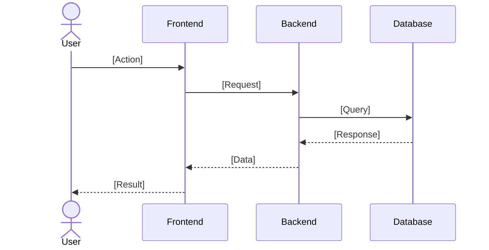

# Sequence Diagrams

This section should contain Sequence Diagrams that illustrate the interactions between objects in a time-ordered sequence.

#### Sequence Diagram: [Interaction Name]

[Description of the interaction flow]

