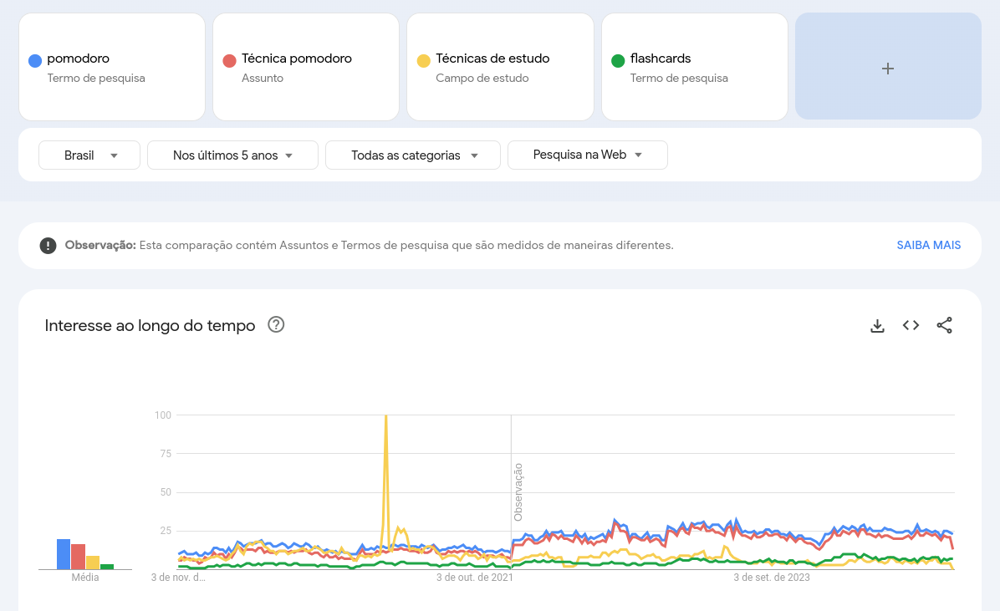
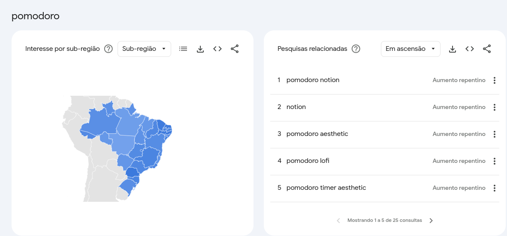
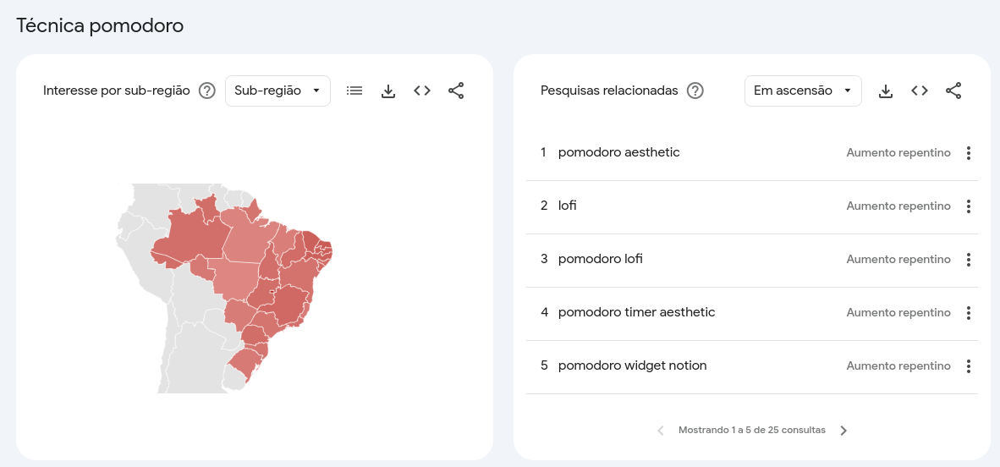
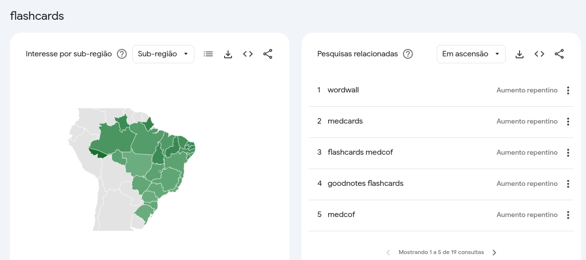

# Desenvolvimento

## Projeto

Este projeto visa desenvolver um aplicativo voltado para o meio acadêmico, combinando as estratégias de estudo Pomodoro e Flashcards em uma única plataforma. O objetivo é criar uma solução completa que permita aos usuários gerenciar seu tempo de estudo de forma eficiente e organizar seus materiais de aprendizado de maneira efetiva.

Uma das principais funcionalidades do aplicativo será a integração da técnica Pomodoro. Essa técnica de gerenciamento de tempo ajudará os usuários a manterem sua concentração e produtividade durante os momentos de estudo. Além disso, o aplicativo contará com ferramentas de criação e edição de flashcards, uma estratégia amplamente utilizada por estudantes para memorização e revisão de conteúdo.

Outra funcionalidade chave será o mercado interno, onde os usuários poderão negociar seus flashcards usando uma moeda própria da plataforma. Essa integração de um ambiente de compra e venda de material de estudo criará um ecossistema dinâmico de aprendizado, incentivando a troca de conhecimento e a colaboração entre os usuários.

Ao combinar estratégias de estudo comprovadas, gerenciamento de tempo e um mercado interno, o aplicativo se posicionará como uma solução inovadora e completa para as necessidades do meio acadêmico. Espera-se que essa integração de ferramentas melhore o desempenho e o engajamento dos estudantes, além de fomentar a colaboração e o compartilhamento de conhecimento entre os usuários.

O desenvolvimento deste aplicativo visa atender às demandas do público acadêmico, oferecendo uma plataforma que integre eficientemente as principais estratégias de estudo e aprendizado.

### Objetivo Geral

O objetivo geral deste projeto é desenvolver um aplicativo que combine as estratégias de estudo Pomodoro e Flashcards, oferecendo aos usuários do meio acadêmico uma plataforma integrada e eficiente para gerenciar seu tempo de estudo e organizar seus materiais de aprendizado.

### Objetivos Específicos

1. **Implementar a funcionalidade de Pomodoro**: integrar a técnica Pomodoro no aplicativo, permitindo que os usuários gerenciem seu tempo de estudo de forma eficiente, alternando períodos de trabalho intenso e breves intervalos.

2. **Desenvolver ferramentas de criação e edição de Flashcards**: criar uma interface intuitiva para que os usuários possam criar, armazenar, editar e organizar seus flashcards de forma eficaz.

3. **Estabelecer um Mercado Interno de Flashcards**: implementar um sistema de compra e venda de flashcards entre os usuários, utilizando uma moeda própria da aplicação, a fim de fomentar a troca de conhecimento e a colaboração na comunidade acadêmica.

4. **Integrar as funcionalidades de Pomodoro e Flashcards**: garantir uma experiência fluida e integrada entre as estratégias de estudo Pomodoro e o uso de Flashcards, otimizando o fluxo de aprendizado dos usuários.

5. **Desenvolver uma Interface Intuitiva e Acessível**: criar uma interface de usuário intuitiva, responsiva e acessível, de modo a facilitar a adoção e a usabilidade do aplicativo por parte do público-alvo.

6. **Promover a Colaboração e Compartilhamento de Conhecimento**: Através do Mercado Interno de Flashcards, incentivar a colaboração e o compartilhamento de conhecimento entre os usuários do aplicativo, fomentando o aprendizado mútuo.

---

## Mercado

### Análise de Mercado

#### Público Alvo
O aplicativo tem como público-alvo estudantes de ensino médio ao nível universitário, abrangendo:

| Perfil | Descrição |
| --- | --- |
| Estudantes do Ensino Médio | Alunos que buscam ferramentas para melhorar sua organização e produtividade nos estudos, preparando-se para o ambiente universitário. |
| Estudantes Universitários | Alunos de graduação e pós-graduação que precisam gerenciar seu tempo de estudo e organizar seu material de aprendizado de forma eficiente. |
| Estudantes Autônomos | Indivíduos que estudam de forma independente, como preparatórios para concursos ou cursos livres, e necessitam de estratégias de estudo eficazes. |

Esse público-alvo foi selecionado com base na necessidade de ferramentas que combinem eficientemente a gestão do tempo de estudo (técnica Pomodoro) e a organização de conteúdo (flashcards), além da oportunidade de compartilhar e trocar conhecimento por meio do mercado interno de flashcards, atendendo às demandas dos estudantes desde o ensino médio até o nível universitário.

---

#### Análise da Concorrência

Ao analisar o mercado, foram identificados alguns aplicativos e plataformas que oferecem funcionalidades semelhantes ao aplicativo proposto, embora de forma fragmentada. Alguns dos principais concorrentes são:

| **Concorrente** | **Funcionalidades**                                                               | **Pontos** **Fortes** | **Pontos** **Fracos**                                                                                                                 |
| --- |-------------------------------------------------------------------------------| --- |-------------------------------------------------------------------------------------------------------------------------------|
| **Anki** | - Criação e revisão de flashcards   - Gerenciamento de deck de flashcards | - Ampla base de usuários   - Algoritmo de repetição espaçada eficiente | - Não possui integração com a técnica Pomodoro   - Interface pouco intuitiva                                              |
| **Forest** | - Técnica Pomodoro   - Gerenciamento de tempo de estudo                    | - Interface amigável   - Gamificação da técnica Pomodoro | - Não possui funcionalidades de flashcards   - Apenas gerenciamento de tempo, sem organização de conteúdo                  |
| **Quizlet** | - Criação e revisão de flashcards   - Compartilhamento de flashcards       | - Ampla biblioteca de flashcards compartilhados   - Ferramentas de aprendizado interativas | - Não possui integração com a técnica Pomodoro   - Foco apenas na funcionalidade de flashcards, sem gerenciamento de tempo |

Essa análise da concorrência permite identificar as principais lacunas no mercado, as quais o aplicativo proposto pode preencher ao combinar as funcionalidades de gerenciamento de tempo (Pomodoro) e organização de conteúdo (flashcards), além de oferecer um mercado interno de flashcards para a troca de conhecimento entre os usuários.

---

#### Tendências:
- **Crescente demanda por ferramentas de gerenciamento de tempo e organização de estudo**: Estudantes e profissionais do meio acadêmico buscam cada vez mais soluções integradas que os ajudem a gerenciar seu tempo de estudo e aprendizado de forma eficiente.
- **Adoção da técnica Pomodoro no ambiente acadêmico**: A técnica Pomodoro vem ganhando popularidade entre estudantes e pesquisadores, que a utilizam para aumentar sua produtividade durante os momentos de estudo e trabalho.
- **Necessidade de compartilhamento e colaboração no aprendizado**: Existe uma demanda crescente por plataformas que permitam a troca de conhecimento e a colaboração entre estudantes e profissionais do meio acadêmico.

Usando alguns termos para pesquisa no Google Trends vemos que há uma busca ativa sobre os termos chaves como: pomodoro, flashcards, etc

**Gráficos por termos:**
- Pomodoro

- Técnica Estudo

- Técnica Pomodoro

- Flashcards

---

### Oportunidades:
- **Integração de ferramentas de gerenciamento de tempo e organização de conteúdo**: O mercado carece de soluções que combinem de forma eficiente e fluida a técnica Pomodoro e a utilização de flashcards, atendendo às necessidades dos estudantes.
- **Criação de um ecossistema de compartilhamento de conhecimento**: O desenvolvimento de um mercado interno de flashcards, onde os usuários possam comprar, vender e trocar materiais de estudo, representa uma oportunidade significativa para fomentar a colaboração e a troca de conhecimento no meio acadêmico.
- **Diferenciação por meio da integração de funcionalidades**: A maioria das soluções atuais se concentra em apenas uma das necessidades (gerenciamento de tempo ou organização de flashcards), deixando uma lacuna a ser preenchida por um aplicativo que integre essas funcionalidades de forma completa.

Essas tendências e oportunidades de mercado indicam que o aplicativo proposto pode preencher uma demanda relevante do público-alvo, oferecendo uma solução integrada e inovadora para o gerenciamento do tempo de estudo e a organização do conteúdo de aprendizado, além de promover a colaboração e a troca de conhecimento entre os usuários.

### Posicionamento e Diferencial Competitivo

Com base na análise do mercado e das necessidades do público-alvo, o aplicativo proposto se posicionará como uma solução integrada e inovadora, com os seguintes diferenciais competitivos:

1. **Combinação de Pomodoro e Flashcards**: O aplicativo será a única solução do mercado que combina de forma fluida e eficiente a técnica Pomodoro para gerenciamento do tempo de estudo e as funcionalidades de criação, organização e revisão de flashcards. Essa integração permitirá que os usuários otimizem seu processo de aprendizado.

2. **Mercado Interno de Flashcards**: A implementação de um mercado interno, onde os usuários poderão comprar, vender e trocar flashcards usando uma moeda própria da plataforma, será um diferencial competitivo. Essa funcionalidade fomentará a colaboração e a troca de conhecimento entre os estudantes e profissionais do meio acadêmico.

3. **Foco no Público Acadêmico**: Ao concentrar-se especificamente nas necessidades dos estudantes do ensino médio, universitários e profissionais do meio acadêmico, o aplicativo se diferenciará de soluções genéricas de gerenciamento de tempo e flashcards, oferecendo uma experiência personalizada e adaptada às demandas desse público-alvo.

4. **Interface Intuitiva e Acessível**: O aplicativo priorizará o desenvolvimento de uma interface de usuário intuitiva, responsiva e acessível, facilitando a adoção e a usabilidade por parte dos estudantes e profissionais do meio acadêmico, independentemente de seu nível de familiaridade com esse tipo de ferramenta.

Esse posicionamento estratégico, aliado aos diferenciais competitivos do aplicativo, permitirá que o produto se destaque no mercado e se torne uma solução de referência para o gerenciamento eficiente do tempo de estudo e a organização do conteúdo de aprendizado no meio acadêmico.
