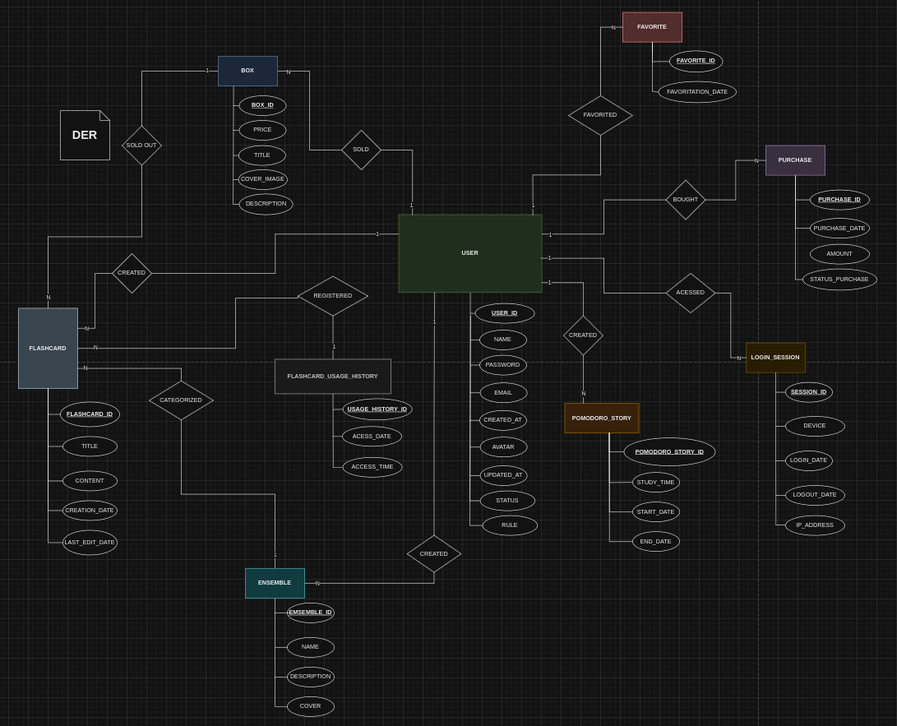
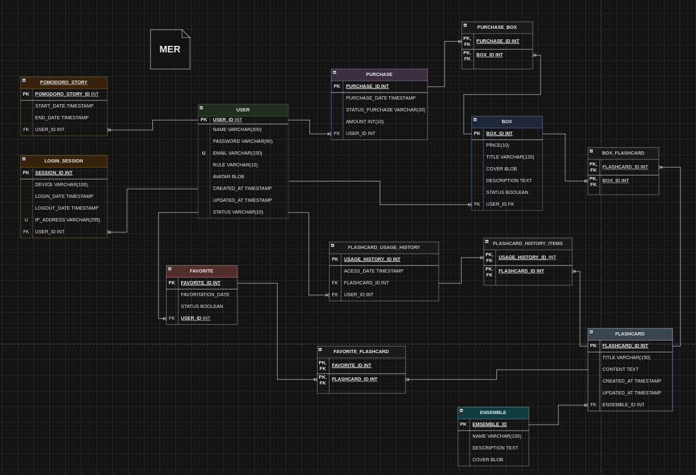

# Engenharia de Software

A engenharia de software é a abordagem sistemática para o desenvolvimento, operação e manutenção de sistemas de software. Nesse contexto, a organização da documentação técnica do nosso projeto é essencial para garantir a qualidade, a manutenibilidade e a evolução do sistema.

Como afirma Pressman (2010), "a documentação técnica é a espinha dorsal da engenharia de software, pois captura os requisitos, a arquitetura, a implementação e os procedimentos operacionais de um sistema".

<br/>

## Requisitos

### Requisitos Funcionais
| Requisito | Descrição                                                                                 | Prioridade | Caso de Uso |
|-----------|-------------------------------------------------------------------------------------------|------------|-------------|
| RF01      | O sistema deverá permitir o cadastro, edição e exclusão de usuários.                      | 1          | UC01        |
| RF02      | O sistema deverá permitir ao usuário logar e deslogar sua conta.                          | 2          | UC02, UC03  |
| RF03      | O sistema deverá permitir ao usuário iniciar, desativar e pausar o temporizador.          | 1          | UC04        |
| RF04      | O sistema deverá permitir realizar ao usuário as funções de criar e consultar o relatório dos pomodoros. | 3          | UC05        |
| RF05      | O sistema deverá permitir ao usuário realizar as funções de criar, editar, consultar e excluir flashcards. | 1          | UC06        |
| RF06      | O sistema deverá permitir ao usuário realizar as funções de adicionar e remover flashcards do histórico. | 2          | UC07        |
| RF07      | O sistema deverá permitir ao usuário realizar as funções de adicionar e remover flashcards dos favoritos. | 2          | UC08        |
| RF08      | O sistema deverá permitir ao usuário realizar as funções de criar, consultar, editar e excluir conjuntos dos flashcards. | 1          | UC09        |
| RF09      | O sistema deverá permitir ao usuário a compra de flashcards usando a moeda do sistema.    | 3          | UC10        |
| RF10      | O sistema deverá permitir a criação de box sells para venda dos flashcards.               | 1          | UC11        |
| RF11      | O sistema deverá permitir ao usuário a venda de flashcards.                               | 1          | UC12        |

<br/>

### Requisitos Não Funcionais
| Requisito | Descrição                                                                                   | Prioridade |
|-----------|---------------------------------------------------------------------------------------------|------------|
| RNF01     | O sistema deve ter uma interface responsiva e adaptável a diferentes tamanhos de tela.       | 1          |
| RNF02     | O sistema deve ter um design intuitivo e de fácil usabilidade.                               | 1          |
| RNF03     | O sistema deve ter um tempo de resposta rápido, mesmo com um grande número de usuários.       | 2          |
| RNF04     | O sistema deve garantir a segurança e privacidade dos dados dos usuários.                    | 1          |
| RNF05     | O sistema deve ser acessível, seguindo as diretrizes de acessibilidade web.                  | 2          |
| RNF06     | O sistema deve ser multiplataforma, funcionando em diferentes sistemas operacionais e dispositivos. | 2     |
| RNF07     | O sistema deve fornecer documentação clara e detalhada para os desenvolvedores.              | 3          |
| RNF08     | O sistema deve realizar backups automáticos diários para prevenir perda de dados.            | 3          |
| RNF09     | O sistema deve permitir integrações com APIs externas para funcionalidades adicionais.        | 3          |

<br/>
<br/>

## Arquitetura de Informação
A arquitetura de informação (AI) para a documentação de software do nosso projeto deve ser orientada a fornecer uma estrutura clara e intuitiva para organizar e disseminar o conhecimento técnico. Segundo Rosenfeld e Morville (2015), a AI "envolve a concepção da estrutura e da navegação de um espaço de informação para facilitar a execução de tarefas e o acesso ao conteúdo".

Nesse contexto, a documentação técnica do nosso projeto pode ser estruturada da seguinte forma:

1. Visão Geral do Sistema:
   - Descrição de alto nível do sistema, suas funcionalidades e objetivos.
   - Diagrama de Casos de Uso para representar as interações entre atores e o sistema.
   - Citação: "A documentação de visão geral fornece uma compreensão comum do sistema, estabelecendo uma base para discussões e decisões posteriores" (IEEE, 2011).

2. Documentação Arquitetural:
   - Diagrama de Componentes para ilustrar a estrutura modular do sistema.
   - Diagrama de Implantação para descrever a infraestrutura e a distribuição dos componentes.
   - Citação: "A documentação arquitetural é essencial para entender o design e as decisões de alto nível que regem o sistema" (Rozanski e Woods, 2011).

3. Documentação de Subsistemas e Módulos:
   - Diagramas de Classe para detalhar as estruturas de dados e os relacionamentos.
   - Diagramas de Sequência para explicar os principais fluxos de interação.
   - Citação: "A documentação de subsistemas e módulos ajuda os desenvolvedores a compreender a implementação e as responsabilidades de cada componente" (Kruchten, 2004).

4. Guias de Desenvolvimento e Implantação:
   - Instruções passo a passo para configurar o ambiente de desenvolvimento.
   - Procedimentos de construção, empacotamento e implantação do sistema.
   - Citação: "A documentação de desenvolvimento e implantação é crucial para permitir que novos membros da equipe comecem a contribuir rapidamente" (McConnell, 1996).

5. Referência de API e Bibliotecas:
   - Documentação detalhada das interfaces de programação (APIs) e bibliotecas utilizadas.
   - Exemplos de uso e padrões de interação.
   - Citação: "A documentação de referência de API e bibliotecas facilita a integração e a reutilização de componentes em todo o sistema" (Krug, 2014).

Essa estrutura de arquitetura de informação ajudará a garantir que a documentação do nosso projeto de software seja compreensível, acessível e eficaz para os desenvolvedores e outras partes interessadas.

<br/>

### Wireframe


<br />


<br />


<br />


<br />

---


<br />


<br />


<br />

---


<br />


<br />

---


<br />


<br />

---


<br />


<br />


<br />


<br />


<br />


<br />

---


<br />


<br />


<br />
<br />

### Banco de Dados

> Resource: [https://drive.google.com/file/d/1IfJADPBk8vBuoPQ7H7mxsLTCevSHhe98/view?usp=sharing](https://drive.google.com/file/d/1IfJADPBk8vBuoPQ7H7mxsLTCevSHhe98/view?usp=sharing)

#### Diagrama Entidade Relacionamento


#### Modelo Entidade Relacionamento


#### Modelo Físico

##### Tabela `USER`
-- Tabela para armazenar informações dos usuários
```sql
CREATE TABLE USER (
   USER_ID INT PRIMARY KEY,           -- Identificador único do usuário
   NAME VARCHAR(200),                 -- Nome do usuário
   PASSWORD VARCHAR(90),              -- Senha do usuário para login
   EMAIL VARCHAR(150) UNIQUE,         -- Email único do usuário
   RULE VARCHAR(10),                  -- Função ou tipo de usuário
   AVATAR BLOB,                       -- Imagem ou avatar do usuário
   CREATED_AT TIMESTAMP,              -- Data e hora em que o usuário foi criado
   UPDATED_AT TIMESTAMP,              -- Data e hora da última atualização
   STATUS VARCHAR(10)                 -- Status do usuário
);
```
##### Tabela `ENSEMBLE`
- Tabela para armazenar informações sobre os conjuntos de flashcards
```sql
CREATE TABLE ENSEMBLE (
   ENSEMBLE_ID INT PRIMARY KEY,       -- Identificador único do conjunto
   NAME VARCHAR(100),                 -- Nome do conjunto
   DESCRIPTION TEXT,                  -- Descrição do conjunto
   COVER BLOB                         -- Capa ou imagem representando o conjunto
);
```
##### Tabela `FLASHCARD`
- Tabela para armazenar informações dos flashcards
```sql
CREATE TABLE FLASHCARD (
   FLASHCARD_ID INT PRIMARY KEY,      -- Identificador único do flashcard
   TITLE VARCHAR(150),                -- Título do flashcard
   CONTENT TEXT,                      -- Conteúdo ou descrição do flashcard
   CREATED_AT TIMESTAMP,              -- Data de criação do flashcard
   UPDATED_AT TIMESTAMP,              -- Data da última atualização do flashcard
   ENSEMBLE_ID INT,                   -- Identificador do conjunto de flashcards a que este flashcard pertence
   FOREIGN KEY (ENSEMBLE_ID) REFERENCES ENSEMBLE(ENSEMBLE_ID)  -- Relacionamento com o conjunto de flashcards
);
```
##### Tabela `FAVORITE`
- Tabela para armazenar informações sobre os favoritos dos usuários
```sql
CREATE TABLE FAVORITE (
   FAVORITE_ID INT PRIMARY KEY,       -- Identificador único do favorito
   FAVORITATION_DATE_TIMESTAMP TIMESTAMP, -- Data e hora em que o flashcard foi marcado como favorito
   STATUS BOOLEAN,                    -- Status do favorito (se está ativo ou não)
   USER_ID INT,                       -- Identificador do usuário que marcou o favorito
   FOREIGN KEY (USER_ID) REFERENCES USER(USER_ID) -- Relacionamento com o usuário
);
```
##### Tabela Pivo `FAVORITE_FLASCARD`
- Tabela para associar flashcards a favoritos
```sql
CREATE TABLE FAVORITE_FLASHCARD (
   FAVORITE_ID INT,                   -- Identificador do favorito
   FLASHCARD_ID INT,                  -- Identificador do flashcard
   PRIMARY KEY (FAVORITE_ID, FLASHCARD_ID), -- Chave composta para garantir que um flashcard não seja duplicado nos favoritos
   FOREIGN KEY (FLASHCARD_ID) REFERENCES FLASHCARD(FLASHCARD_ID), -- Relacionamento com o flashcard
   FOREIGN KEY (FAVORITE_ID) REFERENCES FAVORITE(FAVORITE_ID)   -- Relacionamento com o favorito
);
```
##### Tabela Pivo`FLASHCARD_USAGE_HISTORY`
- Tabela para armazenar o histórico de uso dos flashcards pelos usuários
```sql
CREATE TABLE FLASHCARD_USAGE_HISTORY (
   USAGE_HISTORY_ID INT PRIMARY KEY,  -- Identificador único do histórico de uso
   ACCESS_DATE TIMESTAMP,             -- Data e hora de acesso ao flashcard
   FLASHCARD_ID INT,                  -- Identificador do flashcard
   USER_ID INT,                       -- Identificador do usuário que acessou o flashcard
   FOREIGN KEY (FLASHCARD_ID) REFERENCES FLASHCARD(FLASHCARD_ID), -- Relacionamento com o flashcard
   FOREIGN KEY (USER_ID) REFERENCES USER(USER_ID) -- Relacionamento com o usuário
);
```
##### Tabela Pivo`FLASHCARD_HISTORY_ITEMS`
- Tabela para armazenar os itens do histórico de uso dos flashcards
```sql
CREATE TABLE FLASHCARD_HISTORY_ITEMS (
   USAGE_HISTORY_ID INT,              -- Identificador do histórico de uso
   FLASHCARD_ID INT,                  -- Identificador do flashcard
   PRIMARY KEY (USAGE_HISTORY_ID, FLASHCARD_ID), -- Chave composta para garantir a associação
   FOREIGN KEY (USAGE_HISTORY_ID) REFERENCES FLASHCARD_USAGE_HISTORY(USAGE_HISTORY_ID), -- Relacionamento com o histórico de uso
   FOREIGN KEY (FLASHCARD_ID) REFERENCES FLASHCARD(FLASHCARD_ID) -- Relacionamento com o flashcard
);
```
##### Tabela `TABLE_BOX`
- Tabela para armazenar as caixas de flashcards compradas pelos usuários
```sql
CREATE TABLE BOX (
   BOX_ID INT PRIMARY KEY,            -- Identificador único da caixa
   PRICE INT,                          -- Preço da caixa
   TITLE VARCHAR(120),                 -- Título da caixa
   COVER BLOB,                         -- Capa da caixa
   DESCRIPTION TEXT,                   -- Descrição da caixa
   STATUS BOOLEAN,                     -- Status da caixa (ativa, inativa, etc.)
   USER_ID INT,                        -- Identificador do usuário que comprou ou criou a caixa
   FOREIGN KEY (USER_ID) REFERENCES USER(USER_ID) -- Relacionamento com o usuário
);
```
##### Tabela `BOX_FLASHCARD`
- Tabela para associar flashcards a caixas
```sql
CREATE TABLE BOX_FLASHCARD (
   BOX_ID INT,                         -- Identificador da caixa
   FLASHCARD_ID INT,                   -- Identificador do flashcard
   PRIMARY KEY (BOX_ID, FLASHCARD_ID), -- Chave composta para garantir que um flashcard só apareça uma vez na caixa
   FOREIGN KEY (BOX_ID) REFERENCES BOX(BOX_ID), -- Relacionamento com a caixa
   FOREIGN KEY (FLASHCARD_ID) REFERENCES FLASHCARD(FLASHCARD_ID) -- Relacionamento com o flashcard
);
```
##### Tabela `PURCHASE`
- Tabela para registrar as compras realizadas pelos usuários
```sql
CREATE TABLE PURCHASE (
   EMAIL VARCHAR(150) UNIQUE,          -- Email único do usuário que fez a compra
   RULE VARCHAR(10),                   -- Função do usuário que fez a compra
   AVATAR BLOB,                        -- Avatar do usuário que fez a compra
   PURCHASE_ID INT PRIMARY KEY,        -- Identificador único da compra
   PURCHASE_DATE TIMESTAMP,            -- Data e hora da compra
   STATUS VARCHAR(20),                 -- Status da compra (pendente, concluída, etc.)
   AMOUNT INT,                          -- Quantidade de itens na compra
   USER_ID INT,                        -- Identificador do usuário que fez a compra
   FOREIGN KEY (USER_ID) REFERENCES USER(USER_ID) -- Relacionamento com o usuário
);
```
##### Tabela Pivo`PURCHASE_BOX`
- Tabela para associar caixas a compras
```sql
CREATE TABLE PURCHASE_BOX (
   PURCHASE_ID INT,                    -- Identificador da compra
   BOX_ID INT,                          -- Identificador da caixa comprada
   PRIMARY KEY (PURCHASE_ID, BOX_ID),   -- Chave composta para garantir que a mesma caixa não apareça mais de uma vez na mesma compra
   FOREIGN KEY (PURCHASE_ID) REFERENCES PURCHASE(PURCHASE_ID), -- Relacionamento com a compra
   FOREIGN KEY (BOX_ID) REFERENCES BOX(BOX_ID) -- Relacionamento com a caixa
);
```
##### Tabela `POMODORO_STORY`
- Tabela para registrar as sessões de pomodoro dos usuários:
```sql
CREATE TABLE POMODORO_STORY (
   POMODORO_STORY_ID INT PRIMARY KEY,   -- Identificador único da sessão de pomodoro
   START_DATE_TIMESTAMP TIMESTAMP,      -- Data e hora de início da sessão
   END_DATE_TIMESTAMP TIMESTAMP,        -- Data e hora de término da sessão
   USER_ID INT,                         -- Identificador do usuário que realizou a sessão
   FOREIGN KEY (USER_ID) REFERENCES USER(USER_ID) -- Relacionamento com o usuário
);
```
##### Tabela `LOGIN_SESSION`
- Tabela para registrar as sessões de login dos usuários:
```sql
CREATE TABLE LOGIN_SESSION (
   SESSION_ID INT PRIMARY KEY,          -- Identificador único da sessão de login
   DEVICE VARCHAR(100),                 -- Dispositivo usado para login
   LOGIN_DATE_TIMESTAMP TIMESTAMP,      -- Data e hora do login
   LOGOUT_DATE_TIMESTAMP TIMESTAMP,     -- Data e hora do logout
   IP_ADDRESS VARCHAR(255),             -- Endereço IP de onde o usuário fez login
   USER_ID INT,                         -- Identificador do usuário que fez login
   FOREIGN KEY (USER_ID) REFERENCES USER(USER_ID) -- Relacionamento com o usuário
);
```

<br/>
<br/>

## UML

A Unified Modeling Language (UML) é uma linguagem de modelagem visual padronizada amplamente utilizada na indústria de desenvolvimento de software. Conforme definido pela Object Management Group (OMG), "a UML fornece uma maneira padronizada de visualizar a estrutura e o comportamento de um sistema de software" (OMG, 2017).

Os principais diagramas UML incluem:

1. Diagrama de Casos de Uso (Use Case Diagram): Representa as principais funcionalidades do sistema e as interações entre os atores (usuários, sistemas externos, etc.) e o sistema.

2. Diagrama de Classes (Class Diagram): Descreve a estrutura estática do sistema, mostrando as classes, seus atributos, métodos e os relacionamentos (herança, associação, composição, etc.) entre elas.

3. Diagrama de Sequência (Sequence Diagram): Ilustra a sequência de interações entre objetos ao longo do tempo, capturando a dinâmica do sistema e a troca de mensagens entre eles.

4. Diagrama de Atividades (Activity Diagram): Modela o fluxo de trabalho e as atividades envolvidas em um processo ou em um caso de uso, destacando a ordem e as condições de execução.

Outros diagramas UML, como Diagrama de Pacotes, Diagrama de Componentes e Diagrama de Implantação, são utilizados para modelar diferentes aspectos do sistema, como sua organização modular, elementos de implementação e implantação.

De acordo com a especificação da OMG, "a UML é uma linguagem de modelagem visual unificada que permite aos desenvolvedores especificar, visualizar, construir e documentar os artefatos de um sistema de software" (OMG, 2017).

---

<br/>

### Diagrama de Casos de Uso

#### **UC01 - Gerenciar Usuário**

| **Nome**              | Gerenciar usuário.                                                                                      |
|------------------------|-------------------------------------------------------------------------------------------------------|
| **Descrição**         | Este caso de uso é responsável pela criação e edição de contas de usuários.                            |
| **Fluxo de criação**  | 1. O usuário seleciona, na área de login, a opção "criar conta".<br/>2. O usuário preenche as informações requisitadas pelo sistema, como nome da conta, e-mail e senha.<br/>3. O usuário confirma a senha.<br/>4. O usuário aceita os termos de uso.<br/>5. O sistema valida os dados inseridos.<br/>6. O sistema cria a conta do usuário, exibindo uma mensagem de sucesso. |
| **Fluxo de edição**   | 1. O usuário seleciona o menu.<br/>2. O sistema exibe as opções de menu.<br/>3. O usuário seleciona "conta".<br/>4. O sistema mostra as informações da conta.<br/>5. O usuário seleciona a opção "editar conta".<br/>6. O usuário altera as informações permitidas, como nome ou imagem de perfil.<br/>7. O sistema valida as alterações.<br/>8. O sistema atualiza as informações da conta e exibe uma mensagem de sucesso. |
| **Ator**              | Usuário e Sistema                                                                                     |
| **Pré-condições**     | O usuário deve estar logado no sistema para editar a conta.                                            |
| **Pós-condições**     | Dados do usuário atualizados ou nova conta criada com sucesso.                                         |
| **Fluxo de Exceção**  | 1. Se o e-mail já estiver em uso, o sistema exibe uma mensagem indicando erro e solicita a correção.<br/>2. Se informações obrigatórias não forem preenchidas, o sistema exibe uma mensagem indicando os campos pendentes.<br/>3. O sistema não executa a ação até que todos os erros sejam corrigidos. |


Imagem Caso de Uso UC01

---
<br/>

#### **UC02 - Autenticar Usuário**

| **Nome**              | Autenticar usuário.                                                                                   |
|------------------------|-------------------------------------------------------------------------------------------------------|
| **Descrição**         | Este caso de uso é responsável pelo log in da conta de usuário.                                        |
| **Fluxo Entrar**      | 1. O usuário insere seu e-mail na página de login.<br/>2. O usuário insere sua senha na página de login.<br/>3. O sistema valida os dados inseridos.<br/>4. Caso os dados sejam válidos, o usuário é autenticado e redirecionado à página inicial. |
| **Ator**              | Usuário                                                                                               |
| **Pré-condições**     | O usuário deve estar registrado no sistema.                                                           |
| **Pós-condições**     | Entrada no sistema.                                                                                   |
| **Fluxo de Exceção**  | 1. Caso o e-mail não esteja registrado, o sistema exibe uma mensagem de erro.<br/>2. Caso a senha esteja incorreta, o sistema exibe uma mensagem indicando erro e solicita nova tentativa. |


Imagem Caso de Uso UC02


---
<br/>

#### **UC03 - Deslogar Usuário**

| **Nome**              | Deslogar usuário.                                                                                     |
|------------------------|-------------------------------------------------------------------------------------------------------|
| **Descrição**         | Este caso de uso é responsável pelo log out da conta de usuário.                                       |
| **Fluxo Sair**        | 1. O usuário pressiona no perfil do menu.<br/>2. O usuário pressiona o botão "log out".<br/>3. O sistema exibe um pop-up para confirmação.<br/>4. O usuário confirma o log out.<br/>5. O sistema encerra a sessão e redireciona o usuário para a página de login. |
| **Ator**              | Usuário                                                                                               |
| **Pré-condições**     | O usuário deve estar logado no sistema.                                                               |
| **Pós-condições**     | Saída do sistema.                                                                                     |


Imagem Caso de Uso UC03

---
<br/>

#### **UC04 - Gerenciamento de Pomodoro**

| **Nome**              | Gerenciamento de Pomodoro                                                                             |
|------------------------|-------------------------------------------------------------------------------------------------------|
| **Descrição**         | Este caso de uso descreve as funcionalidades de ativação, desativação, pausa e retomada do temporizador de Pomodoro no sistema. |
| **Fluxo de ativação**  | 1. O usuário acessa a funcionalidade de Pomodoro no sistema.<br/>2. O sistema verifica se o usuário está autenticado e tem acesso à funcionalidade.<br/>3. O sistema exibe a interface do temporizador de Pomodoro.<br/>4. O usuário clica no botão "Iniciar Pomodoro".<br/>5. O sistema ativa o temporizador, definindo a duração padrão (ex.: 25 minutos).<br/>6. O sistema inicia a contagem regressiva e exibe o tempo restante.<br/>7. Ao atingir o final do ciclo, o sistema emite um aviso sonoro.<br/>8. O sistema exibe uma mensagem informando a conclusão. |
| **Fluxo de pausa**     | 1. Durante um ciclo ativo, o usuário clica no botão "Pausar Pomodoro".<br/>2. O sistema interrompe a contagem regressiva.<br/>3. O sistema altera o estado para "Pausado".<br/>4. O usuário pode retomar ou parar o ciclo. |
| **Fluxo de retomada**  | 1. Durante um ciclo pausado, o usuário clica no botão "Retomar Pomodoro".<br/>2. O sistema verifica se há um ciclo em estado "Pausado".<br/>3. O sistema retoma a contagem regressiva.<br/>4. O sistema atualiza a interface.<br/>5. Ao atingir o final do ciclo, o sistema emite um aviso sonoro e exibe uma mensagem informando a conclusão. |


Imagem Caso de Uso UC04

---
<br/>

#### **UC05 - Gerenciar Relatório de Pomodoros**

| **Nome**              | Gerenciar Relatório de Pomodoros                                                                      |
|------------------------|-------------------------------------------------------------------------------------------------------|
| **Descrição**         | Este caso de uso é responsável pela criação e consulta de relatórios dos Pomodoros.                   |
| **Fluxo de criação**  | 1. O usuário seleciona a opção “criar relatório de Pomodoro”.<br/>2. O usuário informa o período desejado (datas de início e fim).<br/>3. O sistema gera o relatório com base nos dados.<br/>4. O sistema valida os dados e exibe o relatório gerado.<br/>5. O usuário confirma o relatório. |
| **Fluxo de consulta** | 1. O usuário seleciona a opção “consultar relatório de Pomodoro”.<br/>2. O usuário informa o período desejado ou escolhe relatórios existentes.<br/>3. O sistema exibe o relatório solicitado.<br/>4. O usuário visualiza o relatório. |
| **Ator**              | Usuário e Sistema                                                                                    |
| **Pré-condições**     | O usuário deve estar logado no sistema.                                                               |
| **Pós-condições**     | Relatório de Pomodoros criado ou consultado.                                                          |


Imagem Caso de Uso UC05

---
<br/>

#### **UC06 - Gerenciar Flashcards**


| **Nome**              | Gerenciar Flashcards                                                                                   |
|------------------------|-------------------------------------------------------------------------------------------------------|
| **Descrição**         | Este caso de uso é responsável pela criação, edição e consulta de flashcards do usuário.              |
| **Fluxo de criação**  | 1. O usuário seleciona a opção de adicionar flashcards “+” logo abaixo do Pomodoro.<br/>2. O sistema exibe um formulário para que o usuário preencha as informações do novo flashcard.<br/>3. O usuário preenche as informações solicitadas.<br/>4. O usuário clica no botão "Salvar".<br/>5. O sistema valida as informações.<br/>6. Caso válidas, o sistema salva o novo flashcard.<br/>7. O sistema exibe uma mensagem de sucesso.<br/>8. O sistema atualiza a lista de flashcards do usuário. |
| **Fluxo de edição**   | 1. O usuário seleciona os três pontos do flashcard.<br/>2. O sistema exibe as opções de favoritar, editar ou excluir.<br/>3. O usuário seleciona a opção “editar”.<br/>4. O usuário preenche os novos dados do flashcard.<br/>5. O sistema valida as informações.<br/>6. Caso válidas, o flashcard é atualizado no banco de dados.<br/>7. O sistema exibe uma mensagem de sucesso.<br/>8. O sistema atualiza a lista de flashcards do usuário. |
| **Ator**              | Usuário e Sistema                                                                                    |
| **Pré-condições**     | O usuário deve estar logado no sistema.                                                               |
| **Pós-condições**     | Alteração da lista de flashcards do usuário.                                                          |


Imagem Caso de Uso UC06

---
<br/>

#### **UC07 - Gerenciar Histórico dos Flashcards**


| **Nome**              | Gerenciar Histórico dos Flashcards                                                                    |
|------------------------|-------------------------------------------------------------------------------------------------------|
| **Descrição**         | Este caso de uso é responsável pela adição e remoção de flashcards do histórico.                      |
| **Fluxo principal**   | 1. O usuário seleciona um flashcard.<br/>2. O sistema adiciona o flashcard no histórico.<br/>3. O sistema organiza os flashcards conforme a ordem de acesso. |
| **Fluxo de remoção**  | 1. O usuário seleciona a opção “menu”.<br/>2. O sistema exibe as opções de menu.<br/>3. O usuário seleciona a opção “flashcards”.<br/>4. O usuário acessa a interface de gerenciamento de flashcards.<br/>5. O usuário seleciona a opção “Histórico”.<br/>6. O usuário seleciona o flashcard correspondente.<br/>7. O usuário seleciona a opção “Remover do Histórico”.<br/>8. O sistema exibe uma mensagem de confirmação.<br/>9. Caso o usuário confirme, o sistema remove o flashcard do histórico. Caso contrário, volta à tela anterior. |
| **Ator**              | Usuário e Sistema                                                                                    |
| **Pré-condições**     | O usuário deve estar logado no sistema.                                                               |
| **Pós-condições**     | Alteração no histórico de flashcards do usuário.                                                     |


Imagem Caso de Uso UC07

---
<br/>


#### **UC08 - Gerenciar Favoritos**

| **Nome**              | Gerenciar Favoritos                                                                                   |
|------------------------|-------------------------------------------------------------------------------------------------------|
| **Descrição**         | Este caso de uso é responsável pela adição e remoção de flashcards dos favoritos.                     |
| **Fluxo de favoritar** | 1. O usuário seleciona os três pontos no quadrado do flashcard específico.<br/>2. O sistema exibe as opções de favoritar, editar ou excluir.<br/>3. O usuário seleciona a opção “favoritar”. |
| **Fluxo de desfavoritar** | 1. O usuário seleciona os três pontos no quadrado do flashcard específico.<br/>2. O sistema exibe as opções de favoritar, editar ou excluir.<br/>3. O usuário seleciona a opção “desfavoritar”. |
| **Ator**              | Usuário e Sistema                                                                                    |
| **Pré-condições**     | O usuário deve estar logado no sistema.                                                               |
| **Pós-condições**     | Alteração na lista de favoritos do usuário.                                                          |


Imagem Caso de Uso UC08

---
<br/>

#### **UC09 - Gerenciar Conjuntos de Flashcards**

| **Nome**              | Gerenciar Conjuntos                                                                                   |
|------------------------|-------------------------------------------------------------------------------------------------------|
| **Descrição**         | Este caso de uso é responsável pela criação, consulta, edição e exclusão das categorias de flashcards. |
| **Fluxo de criação**  | 1. O usuário seleciona a opção de criar conjunto “+ com uma pasta” logo abaixo do Pomodoro.<br/>2. O sistema exibe um formulário para que o usuário preencha o nome, descrição e cor do novo conjunto.<br/>3. O usuário preenche os requisitos.<br/>4. O usuário confirma a criação do conjunto.<br/>5. O sistema valida as informações.<br/>6. O sistema atualiza as informações e adiciona o novo conjunto. |
| **Fluxo de consulta** | 1. O usuário seleciona a lupa na parte dos conjuntos.<br/>2. O sistema abre um campo de texto para escrita.<br/>3. O usuário digita o nome do conjunto desejado.<br/>4. O usuário confirma a pesquisa.<br/>5. O sistema mostra os conjuntos que correspondem à pesquisa. |
| **Fluxo de edição**   | 1. O usuário seleciona a opção “ver mais” logo abaixo dos conjuntos.<br/>2. O sistema exibe um modal com todos os conjuntos.<br/>3. O usuário seleciona os três pontos de um conjunto.<br/>4. O sistema exibe as opções de editar ou excluir.<br/>5. O usuário escolhe “editar”.<br/>6. O sistema exibe o conjunto com opções para alterar flashcards, nome, descrição ou cor.<br/>7. O usuário confirma as alterações.<br/>8. O sistema valida e atualiza o conjunto no banco de dados. |
| **Ator**              | Usuário e Sistema                                                                                    |
| **Pré-condições**     | O usuário deve estar logado no sistema.                                                               |
| **Pós-condições**     | Criar, consultar, editar ou excluir as categorias dos flashcards.                                     |


Imagem Caso de Uso UC09

---
<br/>


#### **UC10 - Comprar Flashcards**

| **Nome**              | Comprar Flashcards                                                                                   |
|------------------------|-------------------------------------------------------------------------------------------------------|
| **Descrição**         | Este caso de uso é responsável pela compra de flashcards usando a moeda do sistema.                  |
| **Fluxo de Compra**   | 1. O usuário acessa a interface da loja.<br/>2. O sistema exibe uma lista de flashcards disponíveis para compra, com filtros por categoria e preço.<br/>3. O usuário seleciona o flashcard desejado.<br/>4. O sistema verifica se o usuário possui saldo suficiente.<br/>5. Caso tenha saldo, o sistema exibe uma mensagem de confirmação.<br/>6. O usuário confirma a compra.<br/>7. O sistema atualiza a lista de flashcards do usuário e debita o saldo da conta.<br/>8. O sistema exibe o flashcard comprado ao usuário. |
| **Ator**              | Usuário e Sistema                                                                                    |
| **Pré-condições**     | O usuário deve estar logado no sistema e possuir saldo suficiente.                                    |
| **Pós-condições**     | Alteração no saldo e atualização da lista de flashcards do usuário.                                  |


Imagem Caso de Uso UC10

---
<br/>


#### **UC11 - Gerenciar Box Sells**

| **Nome**              | Gerenciamento de Box Sells                                                                             |
|------------------------|-------------------------------------------------------------------------------------------------------|
| **Descrição**         | Este caso de uso é responsável pela criação, edição e exclusão de Box Sells.                          |
| **Fluxo de criação**  | 1. O usuário acessa a interface de gerenciamento de Box Sells.<br/>2. O usuário seleciona a opção “Criar Box Sell”.<br/>3. O sistema solicita ao usuário que defina um nome e uma descrição.<br/>4. O usuário escolhe os flashcards a serem incluídos.<br/>5. O sistema exibe um resumo da Box Sell com os flashcards selecionados.<br/>6. O usuário define o preço de venda.<br/>7. O usuário confirma a criação.<br/>8. O sistema adiciona a Box Sell à loja e à lista de vendas disponíveis. |
| **Fluxo de edição**   | 1. O usuário acessa a interface de gerenciamento de Box Sells.<br/>2. O usuário seleciona a Box Sell que deseja editar.<br/>3. O sistema exibe os detalhes da Box Sell.<br/>4. O usuário altera nome, descrição ou flashcards incluídos.<br/>5. O usuário confirma as alterações.<br/>6. O sistema valida e atualiza a Box Sell no banco de dados. |
| **Ator**              | Usuário e Sistema                                                                                    |
| **Pré-condições**     | O usuário deve estar logado no sistema e ter permissões para gerenciar Box Sells.                     |
| **Pós-condições**     | Alteração na lista de Box Sells disponíveis e no banco de dados.                                      |


Imagem Caso de Uso UC11

---

<br/>

#### **UC12 - Vender Flashcards**

| **Nome**              | Vender Flashcards                                                                                     |
|------------------------|-------------------------------------------------------------------------------------------------------|
| **Descrição**         | Este caso de uso é responsável pela venda de flashcards usando a moeda do sistema.                   |
| **Fluxo de Venda**    | 1. O usuário acessa a interface da loja.<br/>2. O usuário seleciona a opção “Venda de Flashcards”.<br/>3. O usuário escolhe o flashcard a ser vendido.<br/>4. O usuário define o valor da venda em moedas do sistema.<br/>5. O usuário confirma a venda.<br/>6. O sistema lista o flashcard para outros usuários.<br/>7. Quando vendido, o sistema credita o valor na conta do usuário e remove o flashcard. |
| **Ator**              | Usuário e Sistema                                                                                    |
| **Pré-condições**     | O usuário deve estar logado no sistema.                                                               |
| **Pós-condições**     | Alteração no saldo e na lista de flashcards do usuário.                                              |


Imagem Caso de Uso UC12

---

<br/>
<br/>

### Diagramas de Sequência

#### Diagrama de Sequencia

#### Criação da conta


#### Edição da conta


#### Exclusão da conta


### Diagrama de Sequencia : UC-02

###### Entrada no Sistema


### Diagrama de Sequencia : UC-03

#### Saida do Sistema


### Diagrama de Sequencia : UC-04

#### Ativação do Pomodoro


#### Desativação do Pomodoro


#### Pausa do Pomodoro    


### Diagrama de Sequencia : UC-05

###### Consulta do Relatórios 


#### Criação dos Relatórios


### Diagrama de Sequencia : UC-06

#### Criação dos Flashcards


#### Edição dos Flashcards


#### Exclusão dos Flashcards


### Diagrama de Sequencia : UC-07

###### Remoção do Histórico dos Flashcards


#### Seleção de um Flashcard do Histórico 


### Diagrama de Sequencia : UC-08

#### Desfavoritar Flashcard dos Favoritos


#### Favoritar Flashcard dos Favoritos


### Diagrama de Sequencia : UC-09

#### 1 Tipo de Consulta dos Conjuntos


#### 2 Tipo de Consulta dos Conjuntos


#### Criação dos Conjuntos


#### Edição dos Conjuntos


#### Exclusão dos Conjuntos


### Diagrama de Sequencia : UC-10


### Diagrama de Sequencia : UC-11

#### Criação das Box Sells


#### Edição das Box Sells


#### Exclusão das Box Sells


### Diagrama de Sequencia : UC-12

#### Venda das Box Sells
