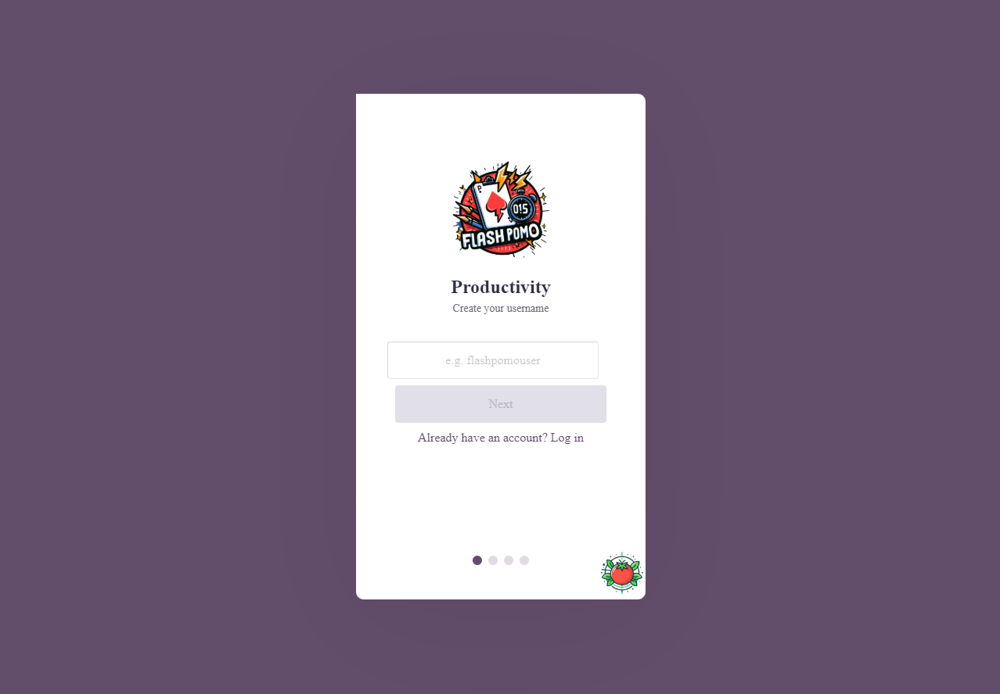
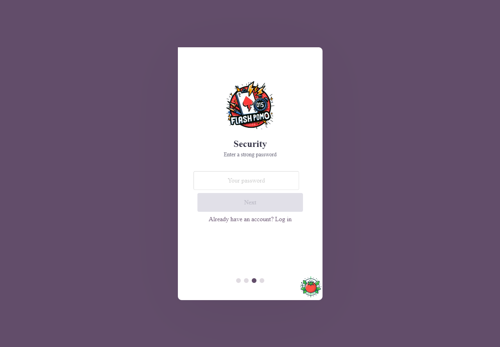
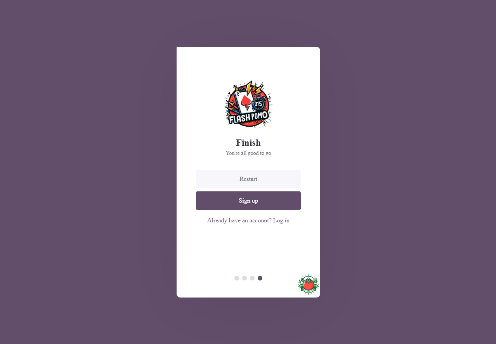
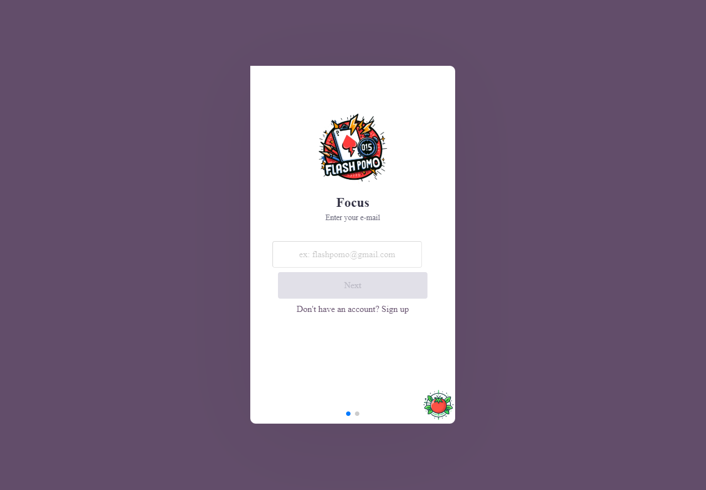
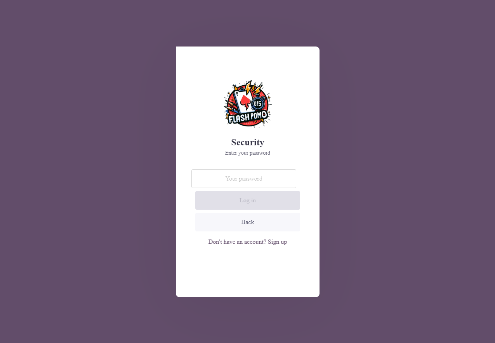
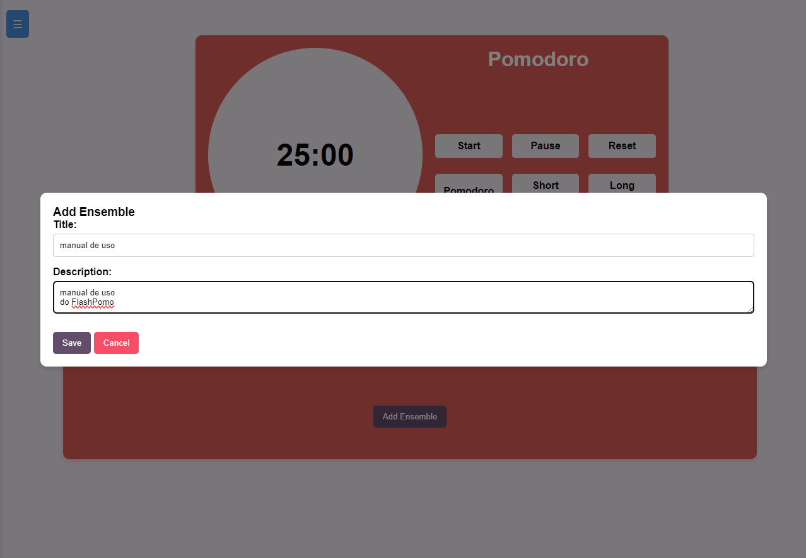
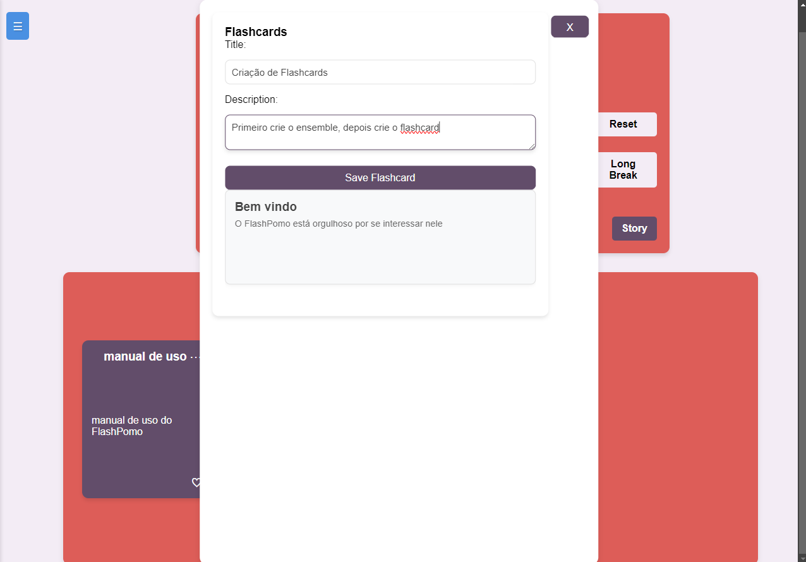
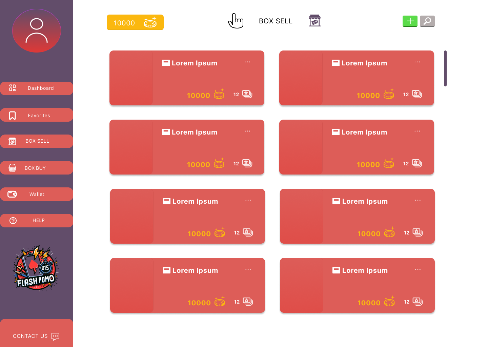
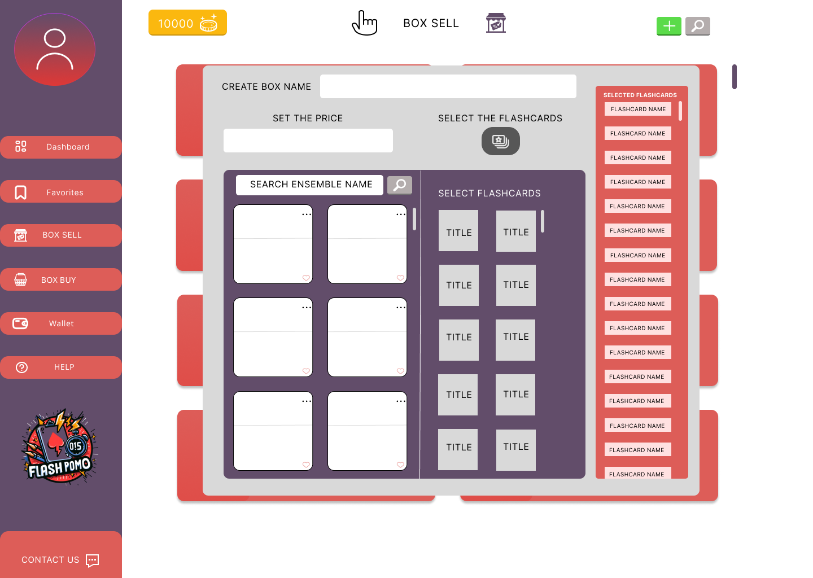
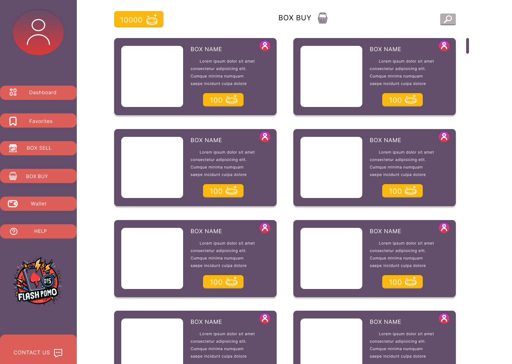

# Manual do Usuário
O manual do usuário tem como objetivo orientar o usuário final do sistema a utilizá-lo de forma adequada e eficiente, contendo informações sobre as funcionalidades, recursos, instruções de uso, solução de problemas e demais informações relevantes ao usuário.

## Cadastro de Usuários e Login
Para realizar o cadastro, o usuário deve informar os dados corretamente, preenchendo os campos necessários, cada campo devidamente preenchido deve ser confirmado pressionando o botão de continuar.

1. Primeiro o usuário criará o nome de usuário.

2. Em seguida o usuário informará o email.

3. O usuário criará sua senha.

4. Após informar os devidos dados, o usuário confirma a criação de conta.

### Pronto, a conta do usuário foi criada! Agora o usuário pode fazer log in.

5. O usuário na página de log in, informa o email.
   
6. O usuário digita sua senha e confirma o log in
   

## Criar FlashCard
Na página de Dashboard o usuário precisará criar primeiramente o ensemble que será o conjunto presente dos flashcards, para tal selecionará o botão add ensemble, o sistema pedirá o título e a descrição do ensemble.
1. Na seção Ensemble List.
   
2. Crie o ensemble, adicione o título e descrição, e salve.
   
3. Pressione no ensemble e crie os flashcards, o título e descrição, depois é só salvar
   

## Criar Box e Vender
Para vender uma box, primeiro o usuário precisa, criá-la.
1. No menu, o usuário entrará na página Box Sell.

2. Nela precisará selecionar o botão de adicionar um "+" ao lado do botão de pesquisa. Em seguida deverá criar a box com os flashcards já existentes e, os quais podem pertencer a vários ensembles, e logo após selecionar o preço.

## Comprar Box
Para comprar uma box, o usuário deverá entrar na página Box Buy, e pesquisar pela box que ele deseja. 
1. O usuário selecionará o botão presente do valor da box, e em seguida confirmará a compra.

## Usar Pomodoro
Para o usuário usar o pomodoro, ele deverá primeiro estar no Dashboard.
1. O usuário poderá escolher no pomodoro as funções Pomodoro, de 25min, short break de 5min, e long break de 15min. também poderá usar as funções de start para começar, pause para pausar e restart para recomeçar. 
