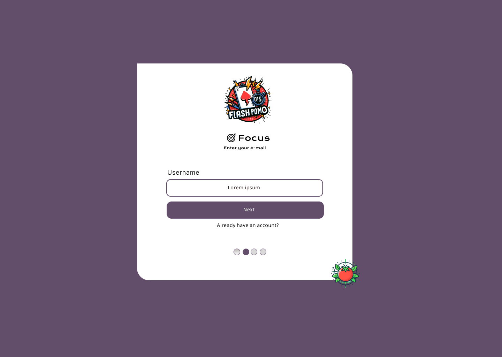
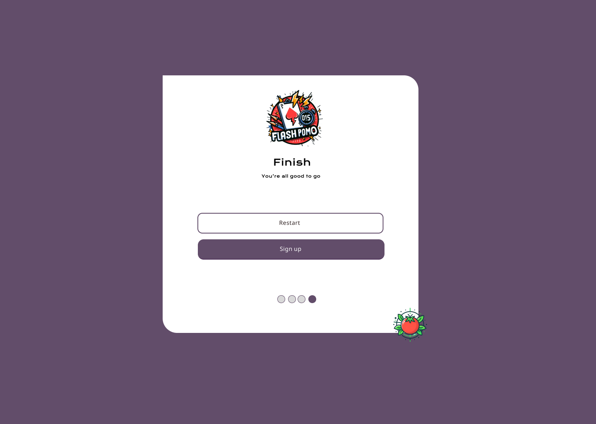
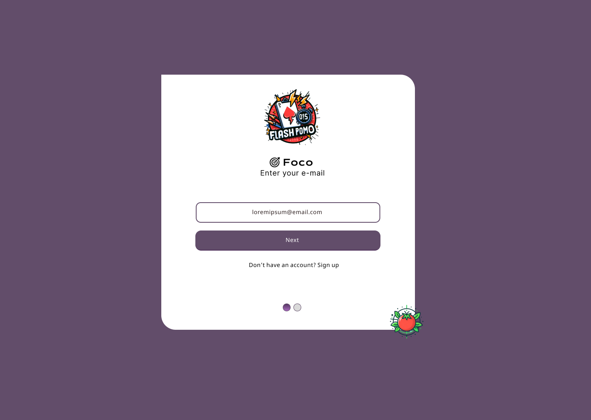
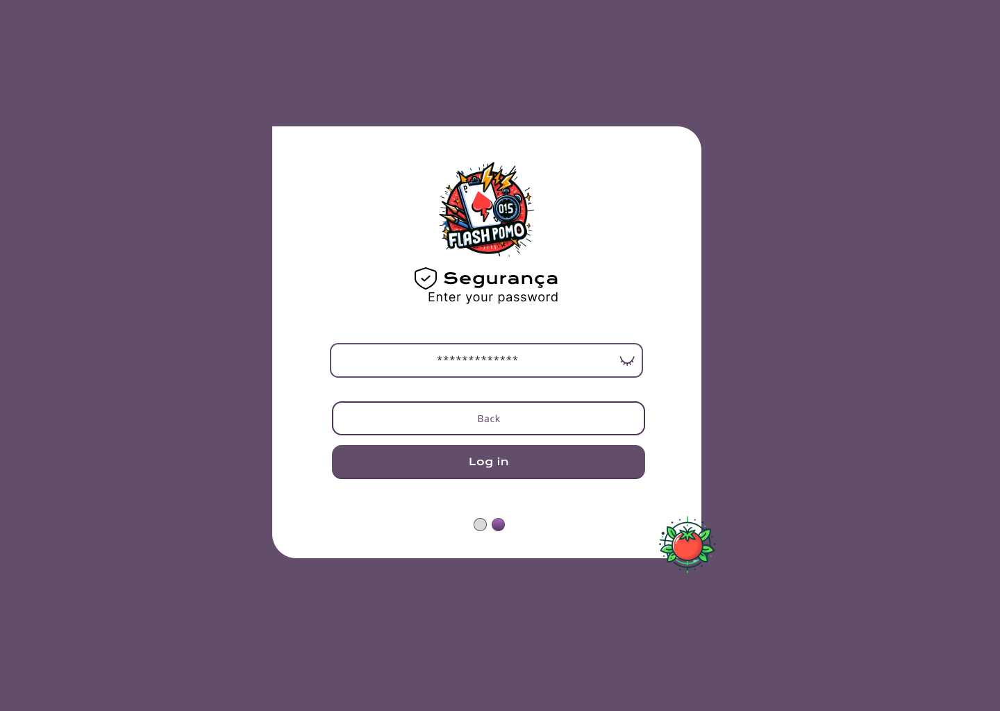

# Manual do Usuário
O manual do usuário tem como objetivo orientar o usuário final do sistema a utilizá-lo de forma adequada e eficiente, contendo informações sobre as funcionalidades, recursos, instruções de uso, solução de problemas e demais informações relevantes ao usuário.

## Cadastro de Usuários e Login
Para realizar o cadastro, o usuário deve informar os dados corretamente, preenchendo os campos necessários, cada campo devidamente preenchido deve ser confirmado pressionando o botão de continuar.

1. Primeiro o usuário criará o nome de usuário.

2. Em seguida o usuário informará o email.

3. O usuário criará sua senha.

4. Após informar os devidos dados, o usuário confirma a criação de conta.

### Pronto, a conta do usuário foi criada! Agora o usuário pode fazer log in.

5. O usuário na página de log in, informa o email.
   
6. O usuário digita sua senha e confirma o log in
   

## Criar FlashCard
Na página de Dashboard 
## Criar Box

## Comprar e Vender

## Usar Pomodoro