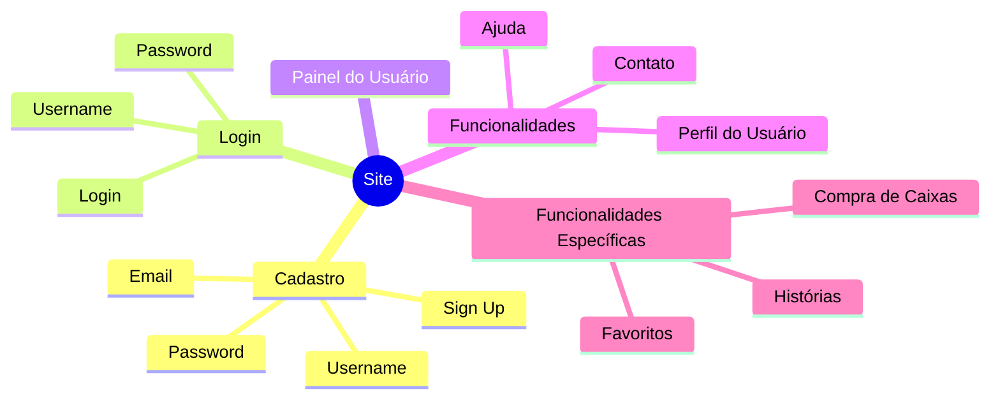

# Mapa do Site
A seção **Mapa do Site** apresenta uma visão estruturada das principais áreas e funcionalidades do site, organizada em formato de mapa mental. Este diagrama facilita a compreensão das seções e fluxos disponíveis, desde o cadastro e login até as funcionalidades específicas oferecidas ao usuário.

