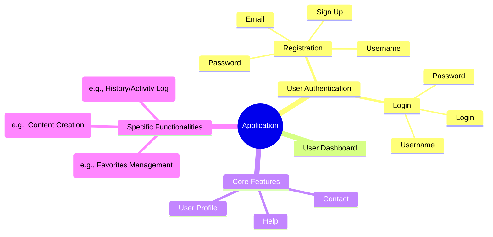

# Sitemap

The **Sitemap** section provides a structured overview of the main areas and functionalities of the application, organized in a mindmap format. This diagram facilitates understanding the available sections and flows, from user registration and login to the specific functionalities offered.

