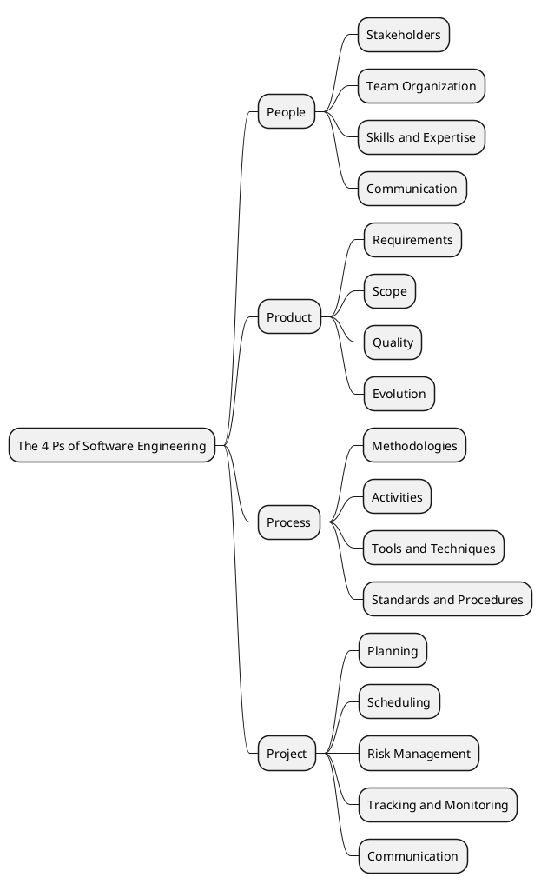

# The 4P's of Software Engineering

The "4P's" framework in software engineering provides a holistic view of the key elements involved in successful software development. These Ps are:

## 1. People

This refers to the human element involved in the software development process. It includes:

*   **Stakeholders:** Anyone affected by the project (users, clients, managers, developers).
*   **Team Organization:** The structure and roles within the development team.
*   **Skills and Expertise:** The knowledge and abilities of the individuals involved.
*   **Communication:** Effective interaction among team members and stakeholders.

## 2. Product

This focuses on the software itself, its requirements, and its evolution. It includes:

*   **Requirements:** Defining what the software should do (functional and non-functional).
*   **Scope:** The boundaries and features of the software.
*   **Quality:** Ensuring the software meets defined standards and user expectations.
*   **Evolution:** How the product will be maintained, updated, and improved over time.

## 3. Process

This describes the framework of activities, tasks, and practices used to build the software. It includes:

*   **Methodologies:** Agile, Waterfall, Scrum, Kanban, etc.
*   **Activities:** Planning, analysis, design, coding, testing, deployment.
*   **Tools and Techniques:** Software development tools, version control, testing frameworks.
*   **Standards and Procedures:** Guidelines for consistent and high-quality work.

## 4. Project

This encompasses the management and execution of the software development effort. It includes:

*   **Planning:** Defining objectives, scope, resources, and timelines.
*   **Scheduling:** Allocating tasks and setting deadlines.
*   **Risk Management:** Identifying, assessing, and mitigating potential problems.
*   **Tracking and Monitoring:** Overseeing progress and making adjustments as needed.
*   **Communication:** Reporting project status to stakeholders.
