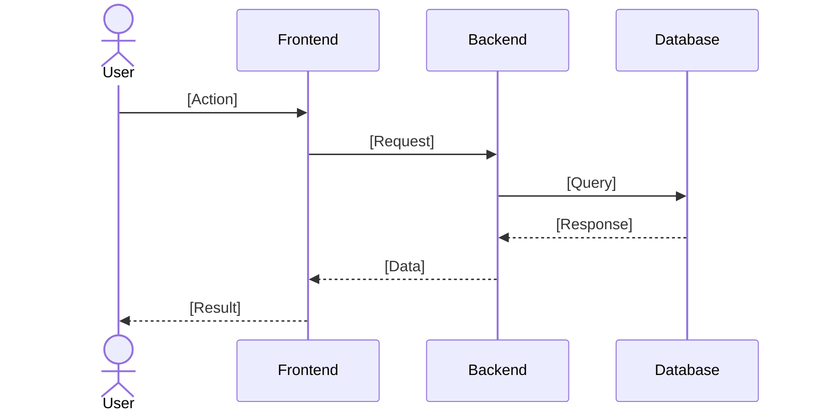

# Software Engineering

Software engineering is the systematic approach to the development, operation, and maintenance of software systems. In this context, the organization of our project's technical documentation is essential to ensure the quality, maintainability, and evolution of the system.

As stated by Pressman (2010), "technical documentation is the backbone of software engineering, as it captures the requirements, architecture, implementation, and operational procedures of a system."

## Requirements

### Functional Requirements

This section outlines the functional requirements of the system. These describe what the system should do.

| Requirement ID | Description | Priority | Use Case/Feature |
|---|---|---|---|
| FR001 | The system shall allow users to [specific action]. | High | [Corresponding Use Case] |
| FR002 | The system shall provide [specific functionality]. | Medium | [Corresponding Use Case] |
| FR003 | The system shall enable [another specific action]. | Low | [Corresponding Use Case] |

### Non-Functional Requirements

This section defines the non-functional requirements, which specify how the system should perform.

| Requirement ID | Description | Priority |
|---|---|---|
| NFR001 | The system shall be responsive and adaptable to different screen sizes. | High |
| NFR002 | The system shall have an intuitive and user-friendly design. | High |
| NFR003 | The system shall have a fast response time, even with a large number of users. | Medium |
| NFR004 | The system shall ensure the security and privacy of user data. | High |
| NFR005 | The system shall be accessible, following web accessibility guidelines. | Medium |
| NFR006 | The system shall be cross-platform, functioning on different operating systems and devices. | Medium |
| NFR007 | The system shall provide clear and detailed documentation for developers. | Low |
| NFR008 | The system shall perform daily automatic backups to prevent data loss. | Low |
| NFR009 | The system shall allow integrations with external APIs for additional functionalities. | Medium |

## Information Architecture

The information architecture (IA) for our project's software documentation should be designed to provide a clear and intuitive structure for organizing and disseminating technical knowledge. According to Rosenfeld and Morville (2015), IA "involves the design of the structure and navigation of an information space to facilitate task completion and content access."

This information architecture structure will help ensure that our software project documentation is understandable, accessible, and effective for developers and other stakeholders.

### Wireframes / Prototypes

This section should include visual representations of the user interface, such as wireframes or prototypes. You can link to external tools (e.g., Figma, Adobe XD) or embed images directly.

> [Link to project's design files or prototype]

#### Example Wireframe: [Feature Name]

[Description of the wireframe and its purpose]


### Database Design

This section should detail the database structure, including Entity-Relationship Diagrams (ERD), Logical Data Models (LDM), and Physical Data Models (PDM). You can include SQL schemas for tables.

> [Link to database documentation or design tool]

#### Entity-Relationship Diagram (ERD)

[Description of your ERD]


#### Physical Data Model (PDM)

[Description of your PDM and table schemas]

##### Table: `[TABLE_NAME]`

```sql
CREATE TABLE [TABLE_NAME] (
   [COLUMN_NAME] [DATA_TYPE] PRIMARY KEY, -- Description of column
   [ANOTHER_COLUMN] [DATA_TYPE],          -- Another column description
   -- Add more columns as needed
   [FOREIGN_KEY_COLUMN] INT,
   FOREIGN KEY ([FOREIGN_KEY_COLUMN]) REFERENCES [REFERENCED_TABLE]([REFERENCED_COLUMN])
);
```

## UML Diagrams

Unified Modeling Language (UML) is a standardized visual modeling language widely used in the software development industry. As defined by the Object Management Group (OMG), "UML provides a standardized way to visualize the structure and behavior of a software system" (OMG, 2017).

According to the OMG specification, "UML is a unified visual modeling language that allows developers to specify, visualize, construct, and document the artifacts of a software system" (OMG, 2017).

### Use Case Diagrams

This section should contain Use Case Diagrams that illustrate the functionality of the system from the user's perspective.

#### Use Case: [Use Case Name]

| Field | Description |
|---|---|
| **Name** | [Name of the Use Case] |
| **Description** | [Brief description of the Use Case] |
| **Flow** | [Step-by-step description of the main flow] |
| **Actor** | [Actors involved in the Use Case] |
| **Preconditions** | [Conditions that must be met before the Use Case can start] |
| **Postconditions** | [Conditions that are true after the Use Case is completed] |
| **Exception Flow** | [Description of alternative or error flows] |


### Class Diagrams

This section should include Class Diagrams that represent the static structure of the system, detailing the main entities and their relationships.

[Description of your Class Diagram and key classes]

```mermaid
classDiagram
    class [ClassName] {
        +[attributeType] [attributeName]
        +[methodName]() [returnType]
    }
    class [AnotherClassName] {
        +[attributeType] [attributeName]
    }
    [ClassName] -- [AnotherClassName] : Relationship Description
```

### Sequence Diagrams

This section should contain Sequence Diagrams that illustrate the interactions between objects in a time-ordered sequence.

#### Sequence Diagram: [Interaction Name]

[Description of the interaction flow]


