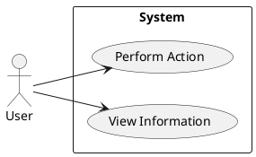

# Use Case Diagrams

This section should contain Use Case Diagrams that illustrate the functionality of the system from the user's perspective.

#### Use Case: [Use Case Name]

| Field | Description |
|---|---|
| **Name** | [Name of the Use Case] |
| **Description** | [Brief description of the Use Case] |
| **Flow** | [Step-by-step description of the main flow] |
| **Actor** | [Actors involved in the Use Case] |
| **Preconditions** | [Conditions that must be met before the Use Case can start] |
| **Postconditions** | [Conditions that are true after the Use Case is completed] |
| **Exception Flow** | [Description of alternative or error flows] |

<!-- You can embed images here or link to external Use Case Diagram tools. Example: -->
<!--  -->

