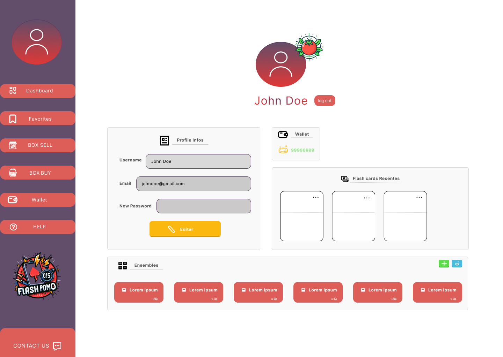
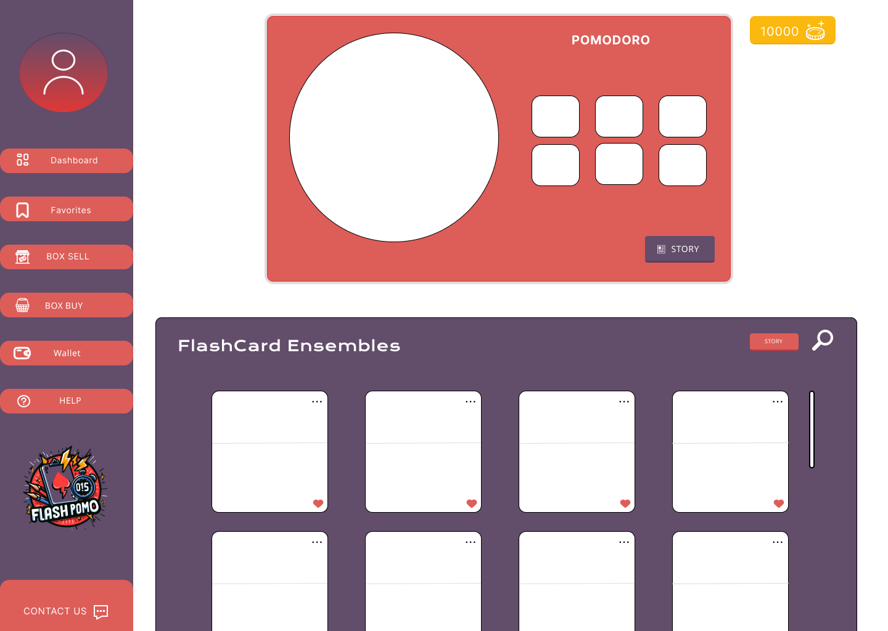
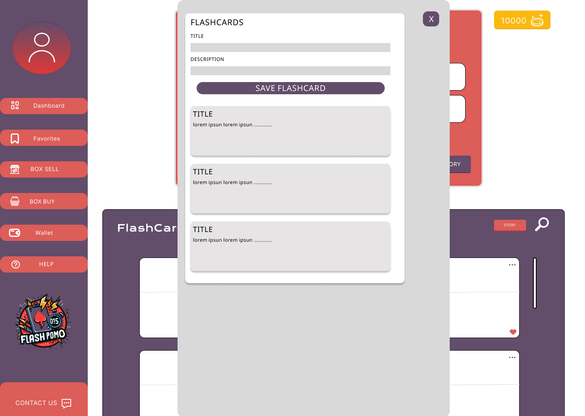
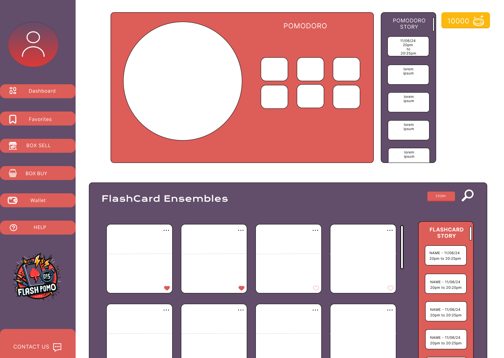
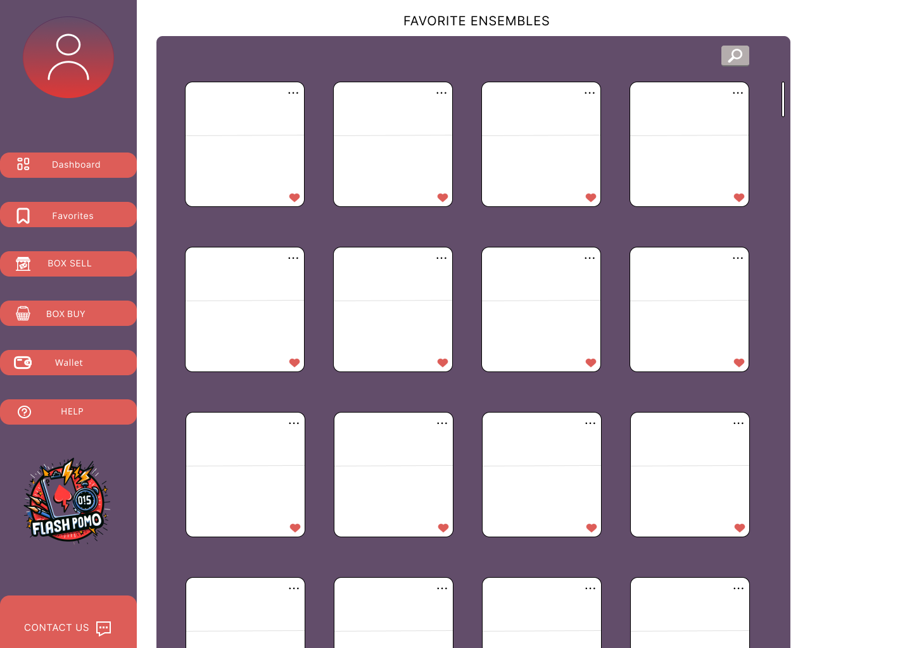
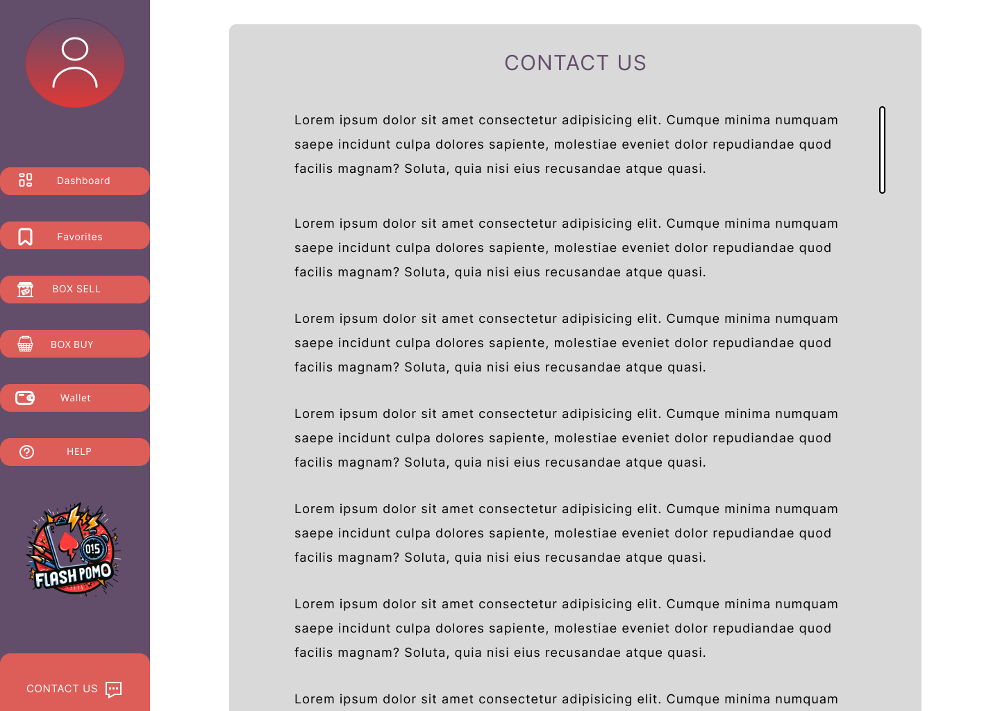

# Wireframe ou Prótotipo

**página de cadastro do email**

**página de cadastro do username**

**página de cadastro do password**

**página de finalização do cadastro**

**página de login para informar email**

**página de login**

**página de perfil do usuário**

**página de dashboard principal do usuário**

**página de dashboard principal do usuário para adicionar flashcards a um ensemble**

**página de dashboard principal do usuário para ver histórico de uso do pomodoro e flashcard**

**página de ensembles favoritos do usuário**

**página de compra de box que contém flashcards**

**página de vendas de box do usuário**

**página de criação de box de vendas do usuário**

**página de ajuda para o usuário**

**página de contato para o usuário**

